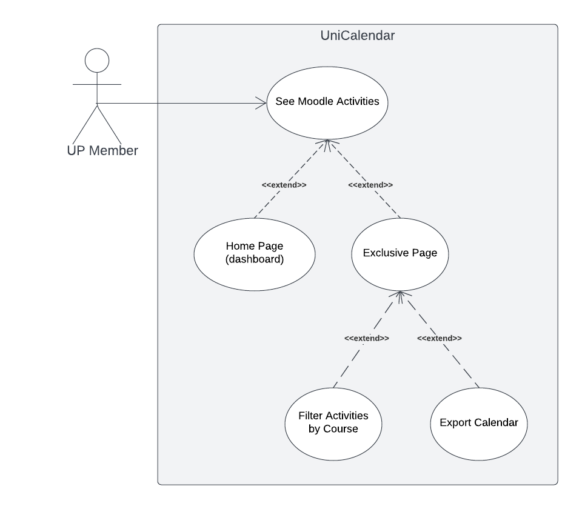

# Requirements

## Use case model

|||
| --- | --- |
| *Name* | See UniCalendar |
| *Actor* |  UP Member | 
| *Description* | The UP member checks a calendar with upcoming Moodle activities through a dashboard on the main page. When the dashboard is clicked, a new page is brought up in which the user will have the possibility of filtering activities by course or exporting the calendar to multiple calendar apps. |
| *Preconditions* | - The UP member must have a UP account. - The UP member must be registered to courses. |
| *Postconditions* | - [Optional] When exporting, the UP member gets the calendar as an ICS file. |
| *Normal flow* | 1. The UP member starts the UNI app.  2. The UP member is presented with a dashboard on the main page showing upcoming moodle activities.  3. The UP member clicks the dashboard to expand it.  4. If wanted, the UP member may filter the calendar by course.  5. If wanted, the UP member can export the calendar to other extern app through an ICS file. |
| *Alternative flows and exceptions* | 1. [No activities] If in step 2 of the normal flow there aren't any exams or any other activity the dashboard displays a simple message stating the case. 2. Alternatively, in step 3 the UP member may expand the lateral panel of the app and click the "Moodle's Activities" option.|

### User stories
This section will contain the requirements of the product described as **user stories** organized in a global **[user story map](https://plan.io/blog/user-story-mapping/)** with **user roles** or **themes**. For each theme, or role, you may add a small description. 

A user story is a description of desired functionality told from the perspective of the user or customer. A starting template for the description of a user story is 

*As a < user role >, I want < goal > so that < reason >.*

User stories should be described as [Issues](https://github.com/LEIC-ES-2021-22/templates/issues) in GitHub. You should give a very short name to the issue and, in the "comments" field, add the user story itself (see above), the image(s) of the user interface mockup(s) (see below) and the acceptance test scenarios (see below). 

**INVEST in good user stories**. 
You may add more details after, but the shorter and complete, the better. In order to decide if the user story is good, please follow the [INVEST guidelines](https://xp123.com/articles/invest-in-good-stories-and-smart-tasks/).

**User interface mockups**.
After the user story text, you should add a draft of the corresponding user interfaces, a simple mockup or draft, if applicable.

**Acceptance tests**.
For each user story you should write also the acceptance tests (textually in [Gherkin](https://cucumber.io/docs/gherkin/reference/)), i.e., a description of scenarios (situations) that will help to confirm that the system satisfies the requirements addressed by the user story.

**Value and effort**.
At the end, it is good to add a rough indication of the value of the user story to the customers (e.g. [MoSCoW](https://en.wikipedia.org/wiki/MoSCoW_method) method) and the team should add an estimation of the effort to implement it, for example, using t-shirt sizes (XS, S, M, L, XL).

As a UP Member, I want to view a calender with my scheduled exams and Moodle activities.
  - User interface mockups
  - Acceptance tests
  - Value and effort

As a UP Member, I want to be able to filter exams or activities that appear in the calendar, so that I can only view events that are relevant to me.

- Notes
  - TBD: DIZER QUAIS OPÇÕES PODEM SER FILTRADAS
- User interface mockups
  - TBD
- Acceptance tests
  - TBD
- Value and effort
  - TBD

As a UP Member, I want to export the calendar generated, so that I can save it to my personal calendar on my phone. 
**Notes**

### Domain model

To better understand the context of the software system, it is very useful to have a simple UML class diagram with all the key concepts (names, attributes) and relationships involved of the problem domain addressed by your module. 
Also provide a short textual description of each class. 

Example:
 

  

