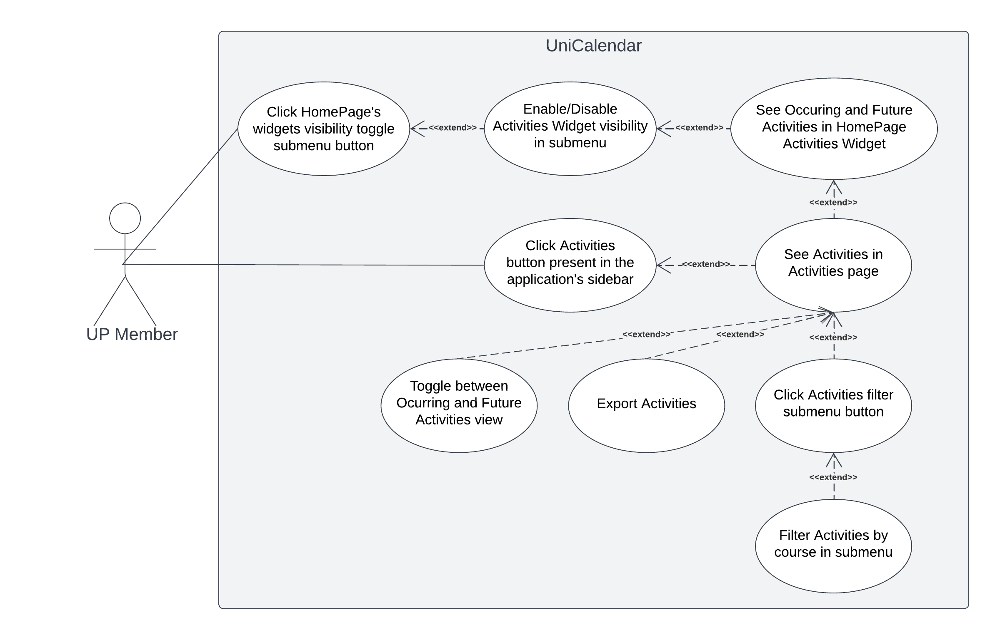

# Requirements

## Use case model

|||
| --- | --- |
| *Name* | See UniCalendar |
| *Actor* |  UP Member | 
| *Description* | The UP member checks a calendar with upcoming Moodle activities through a dashboard on the main page. When the dashboard is clicked, a new page is brought up in which the user will have the possibility of filtering activities by course or exporting the calendar to multiple calendar apps. |
| *Preconditions* | - The UP member must have a UP account. - The UP member must be registered to courses. |
| *Postconditions* | - [Optional] When exporting, the UP member gets the calendar as an ICS file. |
| *Normal flow* | 1. The UP member starts the UNI app.  2. The UP member is presented with a dashboard on the main page showing upcoming moodle activities.  3. The UP member clicks the dashboard to expand it.  4. If wanted, the UP member may filter the calendar by course.  5. If wanted, the UP member can export the calendar to other extern app through an ICS file. |
| *Alternative flows and exceptions* | 1. [No activities] If in step 2 of the normal flow there aren't any exams or any other activity the dashboard displays a simple message stating the case. 2. Alternatively, in step 3 the UP member may expand the lateral panel of the app and click the "Moodle's Activities" option.|

### User stories
 - As an UP member, I want to see a Moodle activity calendar dashboard on the homescreen, so that I can keep up with their deadlines.
 - As an UP member, I want to see a Moodle activity calendar page, so that I can keep up with their deadlines and have more functionalities.
 - As an UP member, I want to be able to filter the calendar for ongoing and future activities by their course, so that I can better keep track of the deadlines (e.g when there are too many activities). 
 - As an UP member, I want to be able to click on the homescreen calendar dashboard, so that I can go to the corresponding page.
 - As an UP member, I want to be able to export the activities calendar with the current filters applied to an external calendar application, so that I can easily synchronize with my everyday use calendar and manage my time more efficiently. 
 - As an UP member, I want to be able to click on an “Moodle’s Activities” option on the application sidebar, so that I can go to the corresponding page.

**User interface mockups**.
After the user story text, you should add a draft of the corresponding user interfaces, a simple mockup or draft, if applicable.

**Acceptance tests**.
For each user story you should write also the acceptance tests (textually in [Gherkin](https://cucumber.io/docs/gherkin/reference/)), i.e., a description of scenarios (situations) that will help to confirm that the system satisfies the requirements addressed by the user story.

**Value and effort**.
At the end, it is good to add a rough indication of the value of the user story to the customers (e.g. [MoSCoW](https://en.wikipedia.org/wiki/MoSCoW_method) method) and the team should add an estimation of the effort to implement it, for example, using t-shirt sizes (XS, S, M, L, XL).

As a UP Member, I want to view a calender with my scheduled exams and Moodle activities.
  - User interface mockups
  - Acceptance tests
  - Value and effort

As a UP Member, I want to be able to filter exams or activities that appear in the calendar, so that I can only view events that are relevant to me.

- Notes
  - TBD: DIZER QUAIS OPÇÕES PODEM SER FILTRADAS
- User interface mockups
  - TBD
- Acceptance tests
  - TBD
- Value and effort
  - TBD

As a UP Member, I want to export the calendar generated, so that I can save it to my personal calendar on my phone. 
**Notes**

### Domain model

 

  

